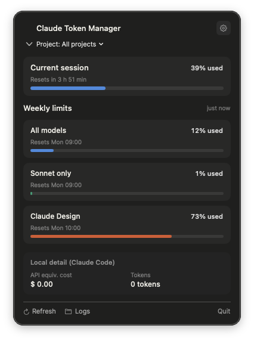
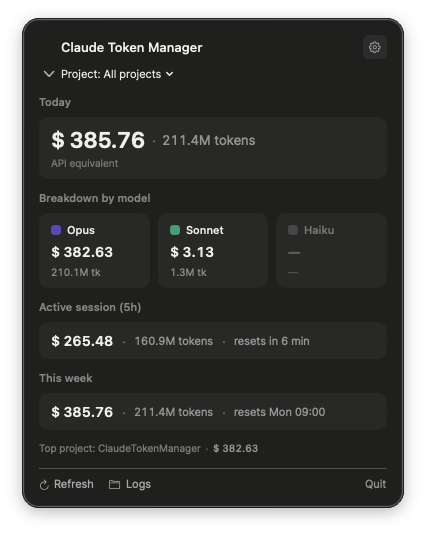
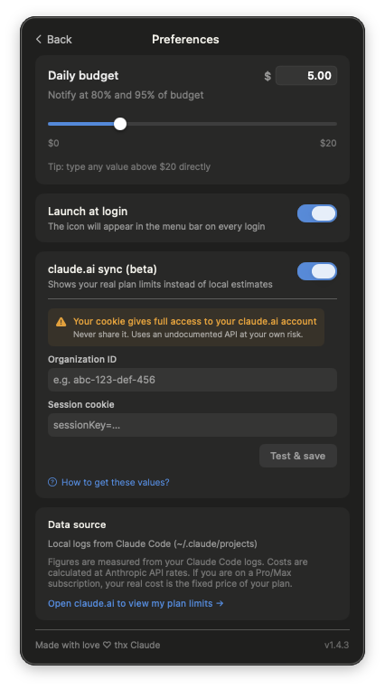

<p align="center">
  
</p>

<h1 align="center">Claude Token Manager</h1>

<p align="center">
  Real-time Claude usage in your macOS menu bar.<br/>
  Local Claude Code activity and live claude.ai plan limits, at a glance.
</p>

<p align="center">
  
  
  
  
</p>

<p align="center">
  
</p>

## Install

```bash
brew tap LuCodes/claude-token-manager
brew install --cask claude-token-manager
```

The cask removes the macOS quarantine attribute automatically, so the
app launches directly without the Gatekeeper prompt.

Alternatively, download the latest `.zip` from the
[releases page](https://github.com/LuCodes/claude-token-manager/releases/latest),
unzip, and drop the app in `/Applications`.

## Features

- **Local mode** — Track Claude Code usage from your local JSONL logs.
  Tokens, per-model breakdown (Opus, Sonnet, Haiku), and
  API-equivalent cost using Anthropic's public pricing.
- **claude.ai sync** — Show real plan limits from your claude.ai
  account: current 5-hour session, weekly pools for Sonnet, Opus,
  Claude Design, and any other pool active on your plan. Matches
  claude.ai/settings/usage exactly.
- **Smart alerts** — macOS notifications when any pool reaches 80 %
  or 95 %. Deduplicated per reset window, so you never get spammed.
- **Daily budget** — Minimalist slider to set a cost cap (in USD),
  with 80 % and 95 % notifications.
- **Native and lightweight** — Pure SwiftUI, runs in the menu bar,
  no dock icon, no background services. Under 5 MB, zero
  third-party dependencies.

## Usage

### Local mode

<p align="center">
  
</p>

Local mode works out of the box if you use Claude Code. The app reads
JSONL logs from `~/.claude/projects/` via FSEvents and aggregates
usage across all projects. You can filter by project from the
dropdown.

API-equivalent cost is calculated using Anthropic's public pricing
for input tokens, output tokens, cache reads and cache writes. So you
can compare what your Claude Code activity would cost on the direct
API. If you're on a Pro or Max subscription, this number is purely
informational — your real cost is your fixed monthly price.

### claude.ai sync mode

<p align="center">
  
</p>

To see real plan limits, open Preferences and click **Sign in to
claude.ai**. A native login window opens — sign in normally with
your email + password (or Google / GitHub SSO). The window closes
automatically once you're authenticated, and the dropdown switches
to the claude.ai layout showing your actual percentages.

Sessions are stored by WebKit in
`~/Library/WebKit/<bundle-id>/`, isolated from Safari. They persist
across app restarts. Click **Sign out** in Preferences to clear
the app's session — this leaves your regular browser session
untouched.

## Security and trust

This is an open-source solo project. Here's exactly what is done and
what is not.

**What's done**

- 100 % open source, all code in this repo
- Zero third-party dependencies — only Apple frameworks (SwiftUI,
  AppKit, WebKit, Foundation, UserNotifications)
- claude.ai authentication runs in a sandboxed WKWebView with a
  per-app cookie store; credentials never touch our Swift code
- Cookies persist on disk under `~/Library/WebKit/<bundle-id>/`,
  isolated from Safari and other apps
- Sign out wipes all claude.ai cookies and storage from the app's
  WebKit data store

**What's not done**

- No Apple Developer ID signature (would cost $99/year for a solo
  project and is not yet justified)
- No Apple notarization
- The Homebrew cask removes the macOS quarantine attribute
  automatically to improve UX. If you prefer Gatekeeper to verify
  every download, install manually from the releases page instead.

> [!WARNING]
> The `claude.ai/api/organizations/*/usage` endpoint used for sync is
> **undocumented** and could change or be blocked by Anthropic at any
> time. Use the sync feature at your own risk. Local mode does not
> depend on this endpoint and will always keep working.

If you have any doubt about trust, audit the code or build from
source yourself with `./build.sh`.

## Build from source

Requirements:
- macOS 13 or later
- Xcode 15 or later (includes Swift 5.9)

```bash
git clone https://github.com/LuCodes/claude-token-manager.git
cd claude-token-manager
./build.sh release
```

The built app appears in `build/Claude Token Manager.app`. Move it to
`/Applications` to install.

Run tests:

```bash
swift test
```

## How it works

**Local mode** uses FSEvents to watch `~/.claude/projects/`. When
Claude Code writes new JSONL entries, the app re-scans the relevant
files, parses the events, and updates token counts and cost
estimates. Pricing per model is stored in `Pricing.swift` and reflects
Anthropic's published rates.

**claude.ai sync mode** runs a hidden WKWebView pointed at
`https://claude.ai/`. Once you've signed in (in the visible login
window), the app fires `fetch('/api/organizations/{orgId}/usage')`
inside that WebView. WebKit takes care of cookies, TLS, CORS,
Fetch Metadata headers, and any future provenance checks Anthropic
may add — our Swift code only reads the JSON response. The result
contains utilization percentages for each pool (session, weekly
all-models, Sonnet, Opus, Claude Design, and others), rendered as
progress bars matching the claude.ai settings page layout.

## Roadmap

- [ ] Historical chart (7 / 30 day view) of usage trends
- [ ] CSV / JSON export of usage data
- [ ] Support for multiple claude.ai accounts
- [ ] Per-project budget notifications
- [ ] Menu bar compact mode (percentage only, no icon)

If you have ideas, open an issue or start a discussion.

## Contributing

Contributions are welcome. Before starting significant work, please:

- Open an issue to align on scope
- Keep commits atomic and use [conventional commit](https://www.conventionalcommits.org/) format
- Add tests when modifying `ClaudeTokenManagerCore`
- Update documentation when user-facing behavior changes

For bug reports, include your macOS version, the app version (shown
in the Preferences footer), and relevant output from `Console.app`
filtered by `Claude Token Manager`.

## Acknowledgments

- [Anthropic](https://anthropic.com) for Claude and the claude.ai
  platform. This is an independent project and is not affiliated
  with or endorsed by Anthropic.
- The [AlDente](https://apphousekitchen.com/) macOS app, whose menu
  bar UX inspired the layout of this app.
- Homebrew maintainers for the excellent cask system.

## License

MIT — see [LICENSE](./LICENSE).
